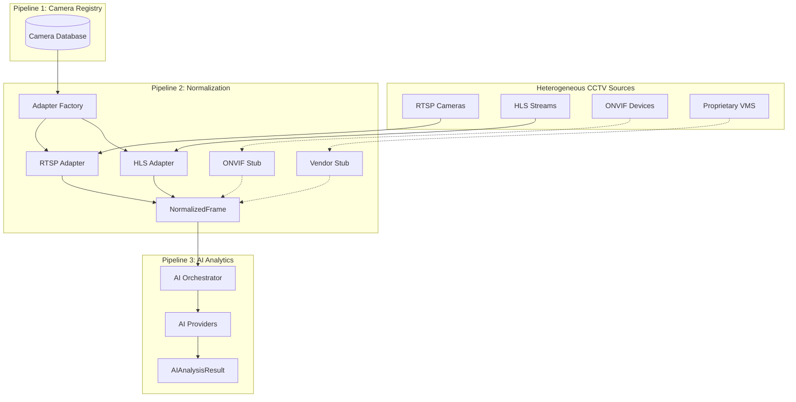

# G-VISTA: Gujarat Video Intelligence & Surveillance Technology Architecture

**Statewide Interoperable AI-Driven Video Intelligence & Investigation Platform**

G-VISTA is an intelligent video federation layer designed to unify heterogeneous CCTV infrastructure across Gujarat Police jurisdictions without requiring the replacement of existing hardware or VMS solutions.

## Problem

The state of Gujarat currently operates thousands of cameras distributed across multiple government departments, traffic systems, and independent security installations. This infrastructure suffers from profound interoperability issues:
- **Heterogeneous Vendors:** A mix of CP Plus, Hikvision, Dahua, Bosch, Sentinel, and legacy custom systems.
- **Divergent Protocols:** Video feeds vary between RTSP, HLS, ONVIF, and proprietary Vendor SDKs.
- **Siloed Investigations:** Detectives and Command Center operators must manually log into different VMS platforms to track a single vehicle across district borders.
- **Cost of Replacement:** "Rip-and-replace" strategies for 80,000+ cameras are financially unviable.

## Solution

G-VISTA introduces a vendor-agnostic federation layer that integrates existing camera feeds exactly as they are. The system is designed as a pipeline:

CCTV Sources
↓
Integration/Federation Layer
↓
Stream Ingestion
↓
AI Video Analytics
↓
Intelligence & Correlation
↓
Alerts & Investigation
↓
Command Center

## Core Intelligence Loop

`DETECT → IDENTIFY → CORRELATE → TRACE → ALERT → INVESTIGATE`

## Pipeline Architecture

| Pipeline | Description | Status |
|---|---|---|
| **Pipeline 1** | Camera Registry & Onboarding | 🟢 IMPLEMENTED |
| **Pipeline 2** | Protocol/Format Normalization | 🟢 IMPLEMENTED |
| **Pipeline 3** | AI Video Analytics & Orchestration | 🟢 IMPLEMENTED / 🔵 MOCK |
| **Pipeline 4** | Intelligence & Correlation | ⚪ PLANNED |
| **Pipeline 5** | Alerts & Investigation | ⚪ PLANNED |

## Technology Stack

- **Backend Framework:** FastAPI (Python 3.9+)
- **Database:** SQLite (Prototype) / SQLAlchemy ORM
- **Video Processing:** OpenCV (cv2), FFmpeg
- **Frontend Framework:** Next.js 15+ (App Router), React 19, Tailwind CSS v4 *(Prototype UI available)*
- **State Management:** Zustand
- **Video Playback:** HLS.js

## Repository Structure

```text
/
├── backend/
│   ├── adapters/      # Pipeline 2: Protocol normalization (RTSP, HLS, ONVIF, Vendor SDK)
│   ├── ai/            # Pipeline 3: AI Orchestrator, schemas, quality metrics
│   ├── services/      # Pipeline 1: Camera registry & onboarding
│   ├── routers/       # FastAPI endpoints
│   ├── models.py      # SQLAlchemy DB models
│   └── main.py        # Application entrypoint
├── app/               # Next.js Frontend
├── docs/              # Comprehensive Documentation
└── PRD.md             # Product Requirements
```

## Architecture Diagram



## Integration Architecture

G-VISTA acts as a consumer to existing streams. Instead of hijacking cameras, the system queries the **Camera Registry** for the internal IP, stream configuration, and credentials. The **Adapter Factory** dynamically spins up the correct protocol handler (e.g., OpenCV for RTSP) on demand to yield a canonical `NormalizedFrame`.

## Scalability

G-VISTA is designed to scale toward 80,000+ cameras by remaining strictly **stateless and on-demand** at the API and AI inference layer.
- Stream connections are only instantiated when an AI worker or a Command Center operator requests them.
- AI inferences utilize sampling (e.g., 5 FPS) rather than blocking all available frames.
- *Note: The current prototype processes single feeds locally. Production scaling will require Kafka and distributed GPU workers.*

## Security

G-VISTA strictly enforces credential isolation. 
- 🟢 **IMPLEMENTED**: `rtsp_url` and physical hardware credentials exist solely within the backend database.
- 🟢 **IMPLEMENTED**: Public APIs (like `/api/cameras`) strictly strip all credential data from the `CameraResponse` schema.
- 🟢 **IMPLEMENTED**: Adapter factories never log sensitive stream URIs.

## Current Status

**Status: PROTOTYPE / HACKATHON STAGE**
Pipelines 1, 2, and 3 are architecturally complete. The system can successfully register cameras, ingest RTSP/HLS feeds securely, normalize frames, and pass them through a fully functional AI orchestration layer containing mocked detection boundaries.

## Future Roadmap

- Integrate real trained ML models (YOLO, PaddleOCR) into the Pipeline 3 interfaces.
- Implement Pipeline 4 (GIS Correlation, VAHAN/SARTHI database integration).
- Migrate from SQLite to PostgreSQL + PostGIS.

## Quick Start

**Backend**
```bash
cd backend
source venv/bin/activate
python -m uvicorn main:app --reload
```

**Frontend**
```bash
npm run dev
```
